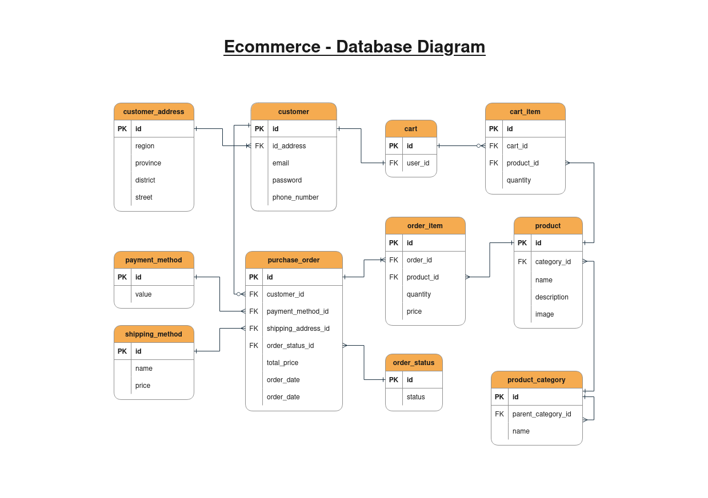

# GM Ecommerce API
- API REST desarrollada para un Ecommerce orientado a la venta de productos de cómputo
- Arquitectura en capas: Presentación, dominio y acceso a datos
- Ejemplo: https://computactus.com.pe/web/marcas

## Modelo Entidad - Relación

## Requerimientos
- Diferentes modalidades de pago (tarjeta de crédito, débito, paypal)
- Diferentes modalidades de envío (a domicilio, punto de entrega, retiro en sucursal)
- Carrito de compras
- Registro de historial de compras
- Categorias de productos:
    - Almacenamiento (HDD, SSD, USB)
    - Case
    - Laptop
    - Periférico (teclado, mouse, monitor, impresora, parlante, micrófono, webcam)
    - Procesador
    - RAM
    - Otros

## Casos de uso
1. Registro e inicio de sesión
2. Buscar productos (x)
3. Agregar productos al carrito
4. Eliminar productos del carrito
5. Elegir una modalidad de pago
6. Elegir una modalidad de envío
7. Comprar producto
8. Revisar el estado de la compra

## Tech Stack
- Java 17
- Spring Framework 6
- Spring Boot 3
- Spring Security
- Spring Data JPA
- Hibernate
- PostgreSQL