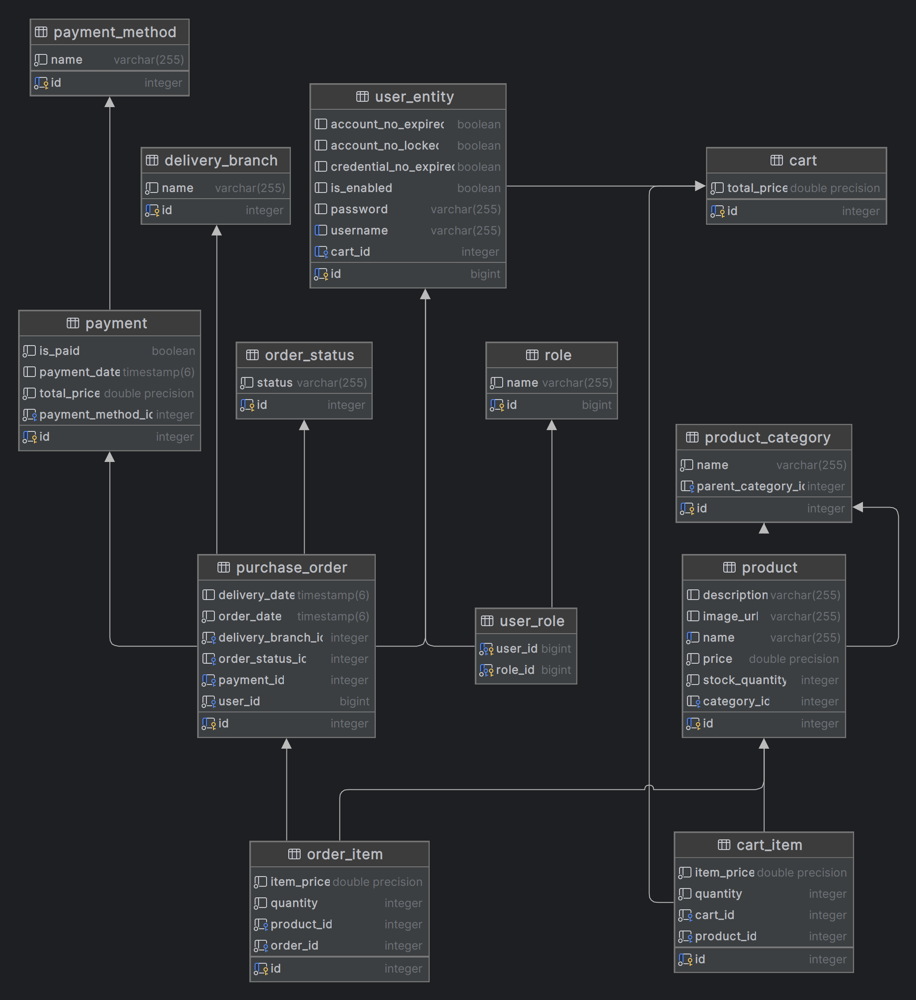

## GM Ecommerce API
- API RESTful para un ecommerce
- Arquitectura en capas
- Roles: Administrador y cliente

### Modelo Entidad - Relación

### Funcionalidades - Cliente
- [x] Buscar productos
- [x] Agregar y eliminar productos del carrito
- [x] Elegir una modalidad de pago
- [x] Realizar compra
- [x] Revisar estado de compra

### Funcionalidades - Administrador
- [x] Agregar, editar y eliminar productos
- [x] Gestionar inventario de productos
- [x] Gestionar pedidos de clientes

### Tech Stack
- Java 21
- Spring Boot
- Spring Web
- Spring Data JPA
- Spring Security
- JWT
- PostgreSQL
- Swagger